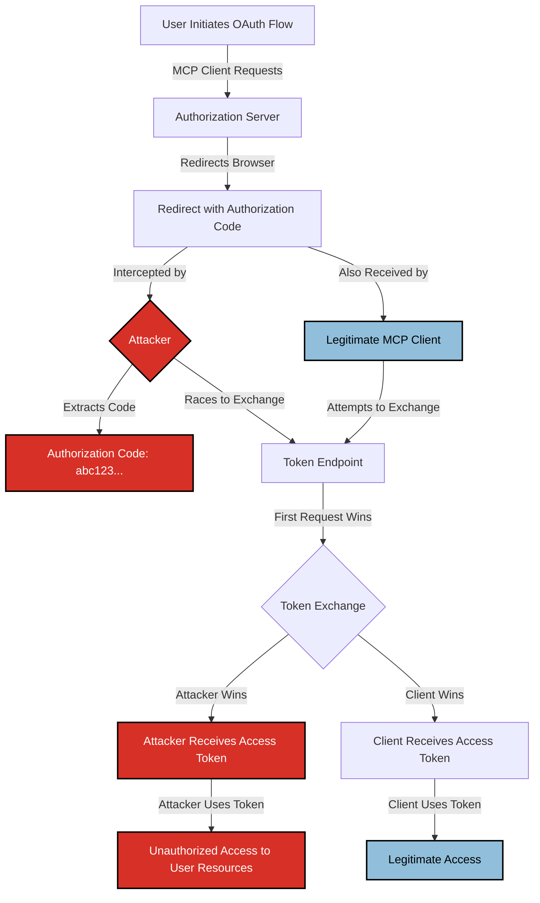

# SAFE-T1507: Authorization Code Interception

## Overview
**Tactic**: Credential Access (ATK-TA0006)  
**Technique ID**: SAFE-T1507  
**Severity**: Critical  
**First Observed**: Not observed in production (theoretical attack based on OAuth 2.0 vulnerabilities)  
**Last Updated**: 2025-01-20

## Description
Authorization Code Interception is an attack technique where adversaries intercept OAuth 2.0 authorization codes during the redirect flow in MCP OAuth implementations. This man-in-the-browser attack exploits the fact that authorization codes are transmitted via URL parameters in browser redirects, making them vulnerable to interception by malicious browser extensions, compromised browser processes, or network intermediaries.

When an MCP client initiates an OAuth flow, the authorization server redirects the user's browser back to the client's redirect URI with an authorization code. An attacker who can intercept this redirect (through browser malware, compromised extensions, or network-level attacks) can extract the authorization code and race to exchange it at the token endpoint before the legitimate client, obtaining access tokens for the user's account.

This technique is particularly dangerous in MCP environments because OAuth flows are often initiated automatically by AI agents without explicit user interaction, making detection of interception more difficult. The attack can be executed silently in the background while the user believes the OAuth flow is proceeding normally.

## Attack Vectors
- **Primary Vector**: Browser-based interception through malicious extensions or compromised browser processes
- **Secondary Vectors**: 
  - Network-level interception (man-in-the-middle attacks on unencrypted connections)
  - Compromised redirect URI handlers that log or leak authorization codes
  - Malicious JavaScript injected into MCP client applications
  - Browser history or referrer header leakage of authorization codes
  - Shared browser processes where authorization codes are visible across tabs

## Technical Details

### Prerequisites
- Attacker must have access to intercept browser redirects (malicious extension, compromised browser, or network position)
- Target MCP implementation must use OAuth 2.0 authorization code flow without PKCE (RFC 7636)
- Authorization codes must be transmitted via URL parameters in redirects
- Attacker must be able to make requests to the OAuth token endpoint

### Attack Flow



1. **Initial Stage**: User initiates OAuth flow through MCP client, which redirects browser to authorization server
2. **Authorization**: User authenticates and authorizes the application, authorization server generates authorization code
3. **Redirect**: Authorization server redirects browser back to MCP client's redirect URI with authorization code in URL parameters
4. **Interception**: Attacker intercepts the redirect (via browser extension, compromised process, or network position) and extracts the authorization code
5. **Race Condition**: Attacker immediately sends authorization code to token endpoint, racing against legitimate MCP client
6. **Token Exchange**: First request to token endpoint with valid authorization code receives access token
7. **Post-Exploitation**: Attacker uses stolen access token to access user's resources on the OAuth-protected service

### Example Scenario
```json
{
  "oauth_flow": {
    "step_1": {
      "action": "authorization_request",
      "url": "https://oauth.example.com/authorize",
      "parameters": {
        "client_id": "mcp_client_123",
        "redirect_uri": "https://mcp-client.example.com/callback",
        "response_type": "code",
        "scope": "read write"
      }
    },
    "step_2": {
      "action": "authorization_response",
      "redirect_url": "https://mcp-client.example.com/callback?code=4/0AeanS0X...&state=xyz123",
      "intercepted_code": "4/0AeanS0X...",
      "attacker_action": "extract_from_url"
    },
    "step_3": {
      "action": "token_exchange_race",
      "legitimate_client": {
        "url": "https://oauth.example.com/token",
        "code": "4/0AeanS0X...",
        "client_id": "mcp_client_123",
        "client_secret": "secret_abc"
      },
      "attacker_request": {
        "url": "https://oauth.example.com/token",
        "code": "4/0AeanS0X...",
        "client_id": "mcp_client_123",
        "client_secret": "stolen_or_guessed"
      },
      "result": "first_request_wins"
    }
  }
}
```

### Advanced Attack Techniques (2015-2024 Research)

According to research from [RFC 7636 (PKCE)](https://tools.ietf.org/html/rfc7636), [OWASP OAuth 2.0 Security Cheat Sheet](https://cheatsheetseries.owasp.org/cheatsheets/OAuth2_Cheat_Sheet.html), and [OAuth 2.0 Security Best Current Practice](https://datatracker.ietf.org/doc/html/draft-ietf-oauth-security-topics), attackers have developed sophisticated interception techniques:

1. **Browser Extension Interception**: Malicious browser extensions can intercept all redirects and extract authorization codes before they reach the legitimate client ([OWASP OAuth 2.0 Security Cheat Sheet](https://cheatsheetseries.owasp.org/cheatsheets/OAuth2_Cheat_Sheet.html))
2. **Shared Process Exploitation**: In shared browser processes, authorization codes visible in one tab can be accessed by malicious code in another tab ([OAuth 2.0 Security Best Practices](https://datatracker.ietf.org/doc/html/draft-ietf-oauth-security-topics))
3. **Referrer Header Leakage**: Authorization codes can leak through HTTP referrer headers when users navigate away from the redirect page ([RFC 7231](https://tools.ietf.org/html/rfc7231))
4. **Browser History Exploitation**: Authorization codes stored in browser history can be accessed by malicious scripts or extensions ([OAuth 2.0 Security Best Current Practice](https://datatracker.ietf.org/doc/html/draft-ietf-oauth-security-topics))
5. **Network-Level Interception**: On unencrypted connections or compromised networks, authorization codes can be intercepted via man-in-the-middle attacks ([OWASP OAuth 2.0 Security Cheat Sheet](https://cheatsheetseries.owasp.org/cheatsheets/OAuth2_Cheat_Sheet.html))

## Impact Assessment
- **Confidentiality**: High - Unauthorized access to user's data on OAuth-protected services
- **Integrity**: High - Ability to modify user's data using stolen access tokens
- **Availability**: Medium - Potential for account lockouts or service disruption through unauthorized actions
- **Scope**: Network-wide - Affects all OAuth-protected services where authorization codes are intercepted

### Current Status (2025)
According to security researchers and OAuth 2.0 best practices, organizations are implementing mitigations:
- RFC 7636 (PKCE - Proof Key for Code Exchange) provides protection against authorization code interception by binding the authorization request to the token exchange ([RFC 7636](https://tools.ietf.org/html/rfc7636))
- OAuth 2.1 specification mandates PKCE for public clients and recommends it for all clients ([OAuth 2.1 Draft](https://datatracker.ietf.org/doc/draft-ietf-oauth-v2-1/))
- Many major OAuth providers (Google, Microsoft, GitHub) now require or strongly recommend PKCE for authorization code flows ([Google OAuth 2.0](https://developers.google.com/identity/protocols/oauth2))
- Browser vendors are implementing stricter isolation between browser processes and extensions to prevent cross-tab code access ([Chrome Extension Security](https://developer.chrome.com/docs/extensions/mv3/security/))

However, many MCP implementations may still use traditional OAuth 2.0 flows without PKCE, leaving them vulnerable to this attack technique.

## Detection Methods

### Indicators of Compromise (IoCs)
- Multiple token exchange requests for the same authorization code from different IP addresses
- Token exchange requests with mismatched client credentials but valid authorization codes
- Authorization codes appearing in browser history, referrer headers, or extension logs
- Unusual timing patterns where token exchange occurs before legitimate client processes redirect
- Access token usage from unexpected IP addresses or user agents
- Authorization codes being exchanged multiple times (though OAuth servers should invalidate codes after first use)

### Detection Rules

**Important**: The following rule is written in Sigma format and contains example patterns only. Attackers continuously develop new interception techniques and obfuscation methods. Organizations should:
- Monitor OAuth token exchange patterns for race conditions
- Implement PKCE (RFC 7636) to prevent authorization code interception
- Use behavioral analysis to detect unusual authorization code usage patterns
- Monitor for authorization codes in unexpected locations (logs, referrers, history)

```yaml
# EXAMPLE SIGMA RULE - Not comprehensive
title: MCP OAuth Authorization Code Interception Detection
id: 2aa0f9c2-f9b0-4b20-96e8-e2325f215491
status: experimental
description: Detects potential authorization code interception through duplicate token exchange attempts
author: SAFE-MCP Team
date: 2025-01-20
references:
  - https://github.com/safe-mcp/techniques/SAFE-T1507
  - https://tools.ietf.org/html/rfc7636
logsource:
  product: mcp
  service: oauth_token_exchange
detection:
  selection_duplicate_code:
    authorization_code|count|gt: 1
    timeframe: 5s
    different_client_id: true
  selection_race_condition:
    token_exchange_timestamp:
      - '|difference|lt: 1s'
    same_authorization_code: true
    different_source_ip: true
  selection_code_in_referrer:
    http_referrer|contains:
      - '*code=*'
      - '*authorization_code=*'
    http_referrer|not|contains:
      - 'oauth.example.com'
  condition: selection_duplicate_code or selection_race_condition or selection_code_in_referrer
falsepositives:
  - Legitimate retry attempts with same authorization code
  - Load-balanced token endpoints with different source IPs
  - Development/testing environments
level: high
tags:
  - attack.credential_access
  - attack.t1550
  - safe.t1507
```

### Behavioral Indicators
- Token exchange requests occurring within milliseconds of authorization redirect
- Authorization codes being used from IP addresses different from the authorization request
- Multiple failed token exchange attempts followed by successful exchange from different source
- Access tokens being used immediately after interception window
- Unusual user agent strings in token exchange requests compared to authorization requests

## Mitigation Strategies

### Preventive Controls
1. **[SAFE-M-13: OAuth Flow Verification](../../mitigations/SAFE-M-13/README.md)**: Implement verification of OAuth flows and explicitly support PKCE (RFC 7636) to bind authorization requests to token exchanges, preventing intercepted codes from being used ([RFC 7636](https://tools.ietf.org/html/rfc7636)).
2. **[SAFE-M-17: Callback URL Restrictions](../../mitigations/SAFE-M-17/README.md)**: Strictly validate and restrict redirect/callback URIs to trusted, pre-registered endpoints to prevent code delivery to attacker-controlled domains.
3. **[SAFE-M-16: Token Scope Limiting](../../mitigations/SAFE-M-16/README.md)**: Minimize granted scopes to reduce impact if an authorization code or token is intercepted.
4. **[SAFE-M-14: Server Allowlisting](../../mitigations/SAFE-M-14/README.md)**: Allowlist trusted OAuth/IdP domains and MCP servers to reduce risk of interacting with malicious endpoints.
5. **[SAFE-M-15: User Warning Systems](../../mitigations/SAFE-M-15/README.md)**: Provide clear, contextual warnings during OAuth flows showing requesting server and target service to help identify suspicious activity.

Note: Enforce HTTPS for all redirects and endpoints (covered under secure configuration best practices) and require strong client authentication for confidential clients per RFC 6749.

### Detective Controls
1. **[SAFE-M-18: OAuth Flow Monitoring](../../mitigations/SAFE-M-18/README.md)**: Monitor token exchange requests for duplicates, race conditions, and suspicious patterns.
2. **[SAFE-M-19: Token Usage Tracking](../../mitigations/SAFE-M-19/README.md)**: Track token usage patterns to flag anomalous access following suspected interception.
3. **[SAFE-M-20: Anomaly Detection](../../mitigations/SAFE-M-20/README.md)**: Use anomaly detection on authentication and token exchange telemetry to identify interception behavior.

### Response Procedures
1. **Immediate Actions**:
   - Revoke all access tokens associated with potentially intercepted authorization codes
   - Invalidate the compromised authorization code to prevent further exchange attempts
   - Alert affected users about potential unauthorized access
   - Review access logs for the affected OAuth-protected service
2. **Investigation Steps**:
   - Analyze token exchange logs to identify interception timing and source
   - Check for duplicate token exchange requests for the same authorization code
   - Review browser extension and process logs for signs of compromise
   - Verify if PKCE was implemented and functioning correctly
3. **Remediation**:
   - Implement PKCE if not already in place
   - Reduce authorization code lifetime
   - Enhance redirect URI validation
   - Update OAuth client configurations to use more secure flows
   - Educate users about browser security and extension risks

## Related Techniques
- [SAFE-T1007](../SAFE-T1007/README.md): OAuth Authorization Phishing — related social-engineering vector
- [SAFE-T1304](../SAFE-T1304/README.md): Credential Relay Chain — intercepted codes can fuel relay attacks

## References
- [Model Context Protocol Specification](https://modelcontextprotocol.io/specification)
- [RFC 7636 - Proof Key for Code Exchange (PKCE) for OAuth Public Clients](https://tools.ietf.org/html/rfc7636)
- [RFC 6749 - The OAuth 2.0 Authorization Framework](https://tools.ietf.org/html/rfc6749)
- [OAuth 2.0 Security Best Current Practice](https://datatracker.ietf.org/doc/html/draft-ietf-oauth-security-topics)
- [OAuth 2.1 Draft Specification](https://datatracker.ietf.org/doc/draft-ietf-oauth-v2-1/)
- [OWASP OAuth 2.0 Security Cheat Sheet](https://cheatsheetseries.owasp.org/cheatsheets/OAuth2_Cheat_Sheet.html)
- [RFC 7231 - Hypertext Transfer Protocol (HTTP/1.1): Semantics and Content](https://tools.ietf.org/html/rfc7231)
- [Google OAuth 2.0 for Client-side Web Applications](https://developers.google.com/identity/protocols/oauth2)
- [Chrome Extension Security Best Practices](https://developer.chrome.com/docs/extensions/mv3/security/)
- [OWASP Top 10 for LLM Applications](https://owasp.org/www-project-top-10-for-large-language-model-applications/)

## MITRE ATT&CK Mapping
- [T1550 - Use Alternate Authentication Material](https://attack.mitre.org/techniques/T1550/) (conceptually similar - using intercepted credentials)
- [T1539 - Steal Web Session Cookie](https://attack.mitre.org/techniques/T1539/) (similar attack pattern for web sessions)

## Version History
| Version | Date | Changes | Author |
|---------|------|---------|--------|
| 1.0 | 2025-01-20 | Initial documentation based on OAuth 2.0 security research and RFC 7636 | Pritika Bista |
